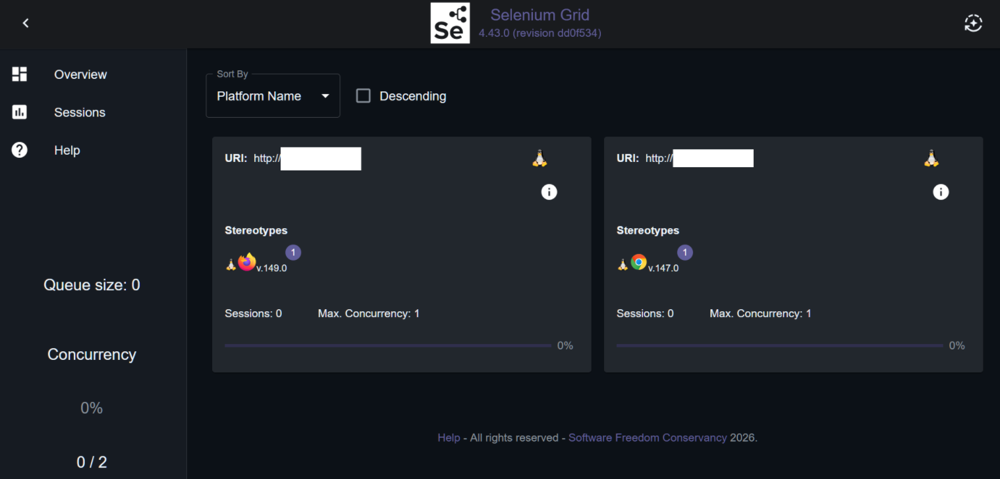
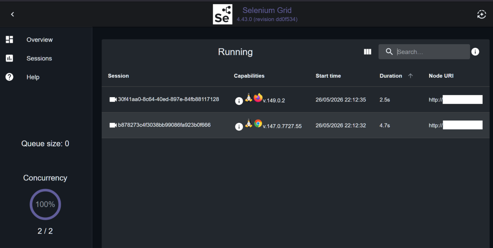
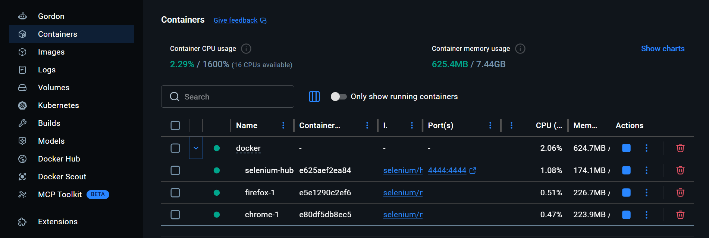
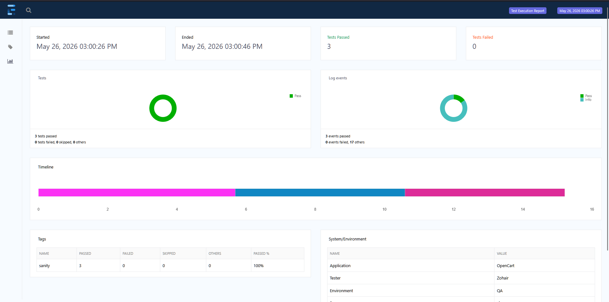
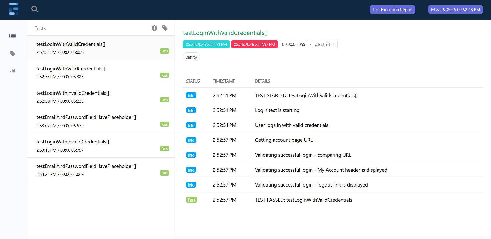
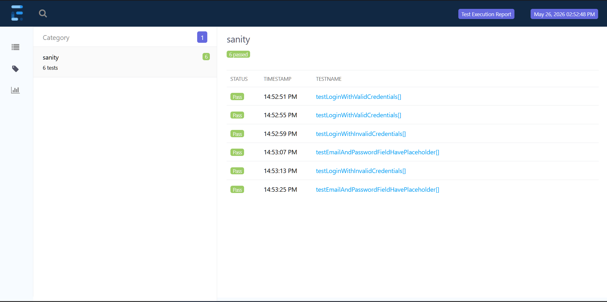
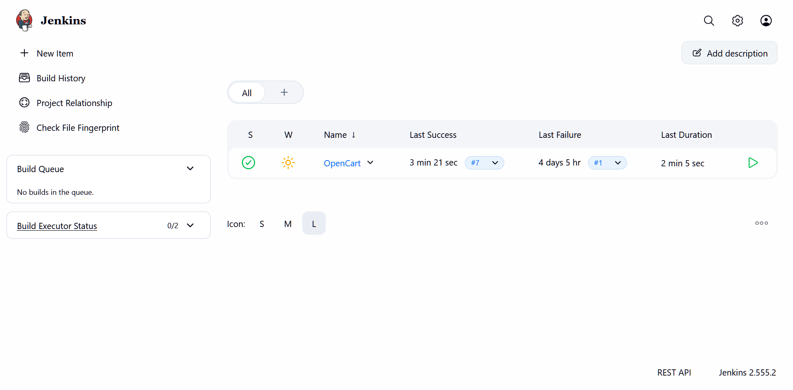
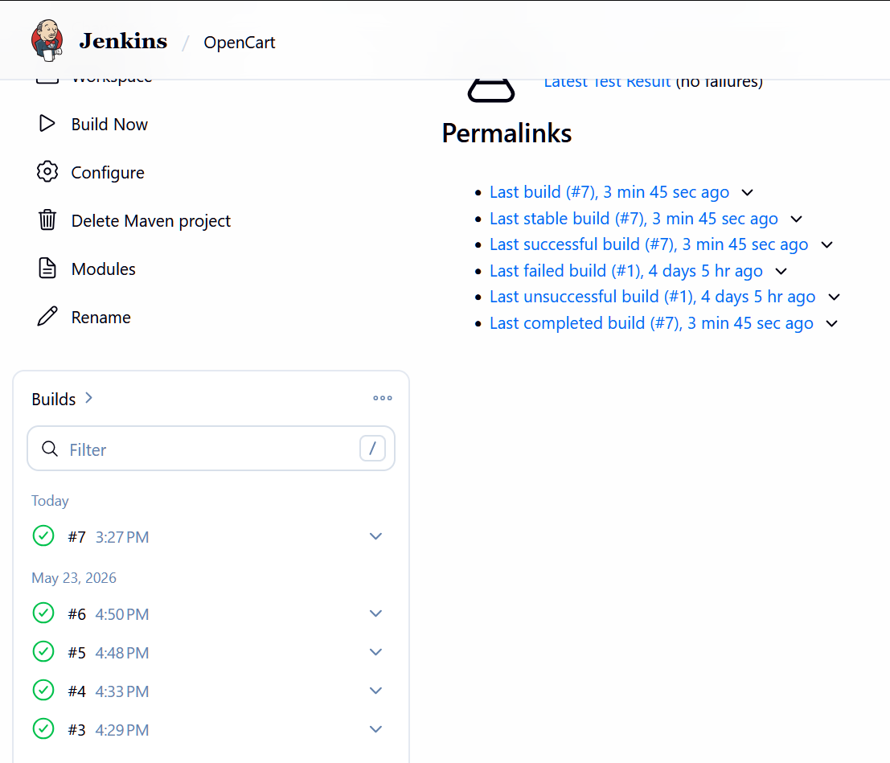
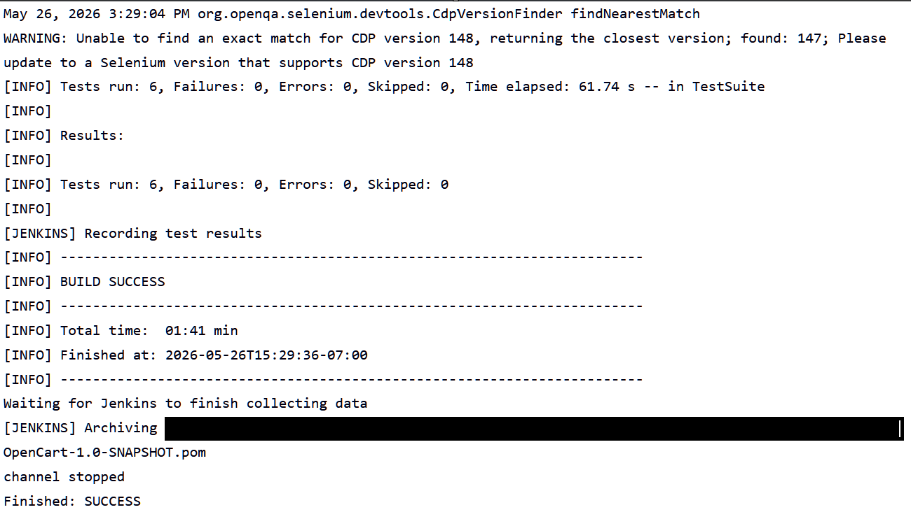
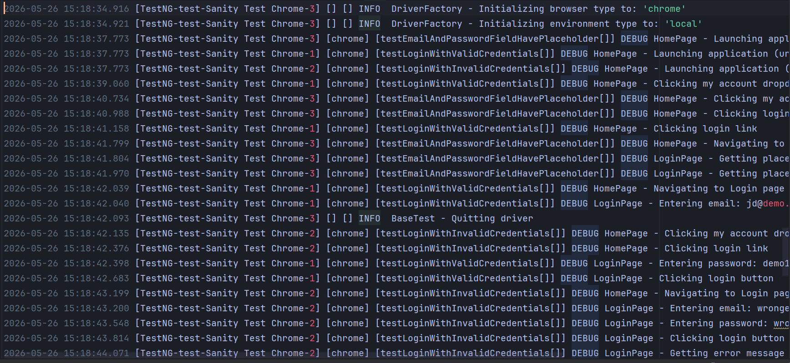

# OpenCart - UI automation framework

- A scalable UI test automation framework for an e-commerce platform built using Java, Selenium WebDriver, TestNG,
  Maven, Docker, and Selenium Grid

## Core Capabilities

- Cross operating-system / cross-browser testing
- Thread-safe parallel execution
- Local and remote execution support
- Selenium Grid execution using Docker
- Jenkins CI integration
- Data-driven testing with Excel
- ExtentReports reporting / Log4j2 logging
- XML-driven TestNG suite execution
- Screenshots on test failure

## Tools/Technologies Used
- Programming Language: `Java`
- Build Tool: `Maven`
- CI: `Jenkins`
- Containerization: `Docker`
- Remote Execution: `Selenium Grid`
- Parallel Execution: `TestNG`
- Reporting: `ExtentReports`
- Logging: `Log4j2`
- Data-Driven Testing: `Apache POI and Excel`
- Test Execution: `TestNG, Maven, and Selenium Grid`
- Configuration Management: `TestNG XML & .properties file`

## Framework Features

- Thread-safe parallel execution
- Cross-operating-system / cross-browser support
- Local and Remote execution environments
- Jenkins CI execution support
- Selenium Grid execution using Docker containers
- Data-driven testing with Excel integration
- Page Object Model design pattern
- Factory and Strategy pattern implemented
- Screenshot capture on test failure
- ExtentReports HTML reporting
- TestNG Listeners for reporting and failure handling
- Utility-based reusable architecture
- Explicit Wait utilities
- Log4j2 logging
- XML-driven browser and operating system configuration

## Framework Architecture (Brief Overview)

```text
docker
logs
reports
screenshots
testSuites
|-- src
|   |-- main
|   |   |-- constants
|   |   |-- driver
|   |       |-- environment
|   |   |-- pages
|   |   |-- utilities
|   |-- test
|       |-- dataprovider
|       |-- listener
|       |-- tests
```

## How To Run

### Pre-Requisites

- `Java, Maven, Selenium Grid, and Docker` installed

#### Clone project

- `git clone https://github.com/zohairawan/OpenCart.git`

#### Run locally - Default Suite XML file

- Make sure execution environment is set to `local` in `config.properties` file
- Run command: `mvn clean test`

#### Run locally - Specific TestNG Suite

- Make sure execution environment is set to `local` in `config.properties` file
- Run command: `mvn clean test -Dsurefire.suiteXmlFiles=testSuites/path/to/suite.xml`

#### Run Selenium Grid + Docker

- Make sure Docker engine is running
- Make sure execution environment is set to `remote` in `config.properties` file
- `cd` into docker directory
- Run command: `docker compose up -d` to start docker containers + selenium grid
- Go back to project root `cd ..`
- Run command: `mvn clean test -Dsurefire.suiteXmlFiles=testSuites/remote/remote-linux.xml`
- Run command: `docker compose down` to stop docker containers + selenium grid

### Selenium Grid


---

---


### ExtentReports


---

---


### Jenkins


---

---


### Parallel Execution Logs



